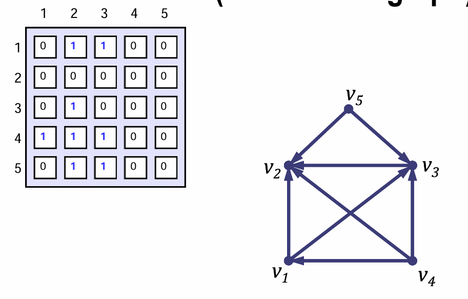
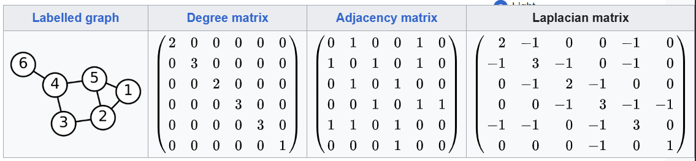
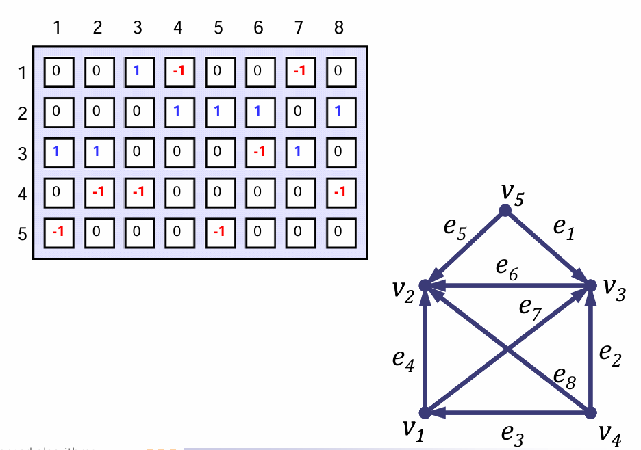
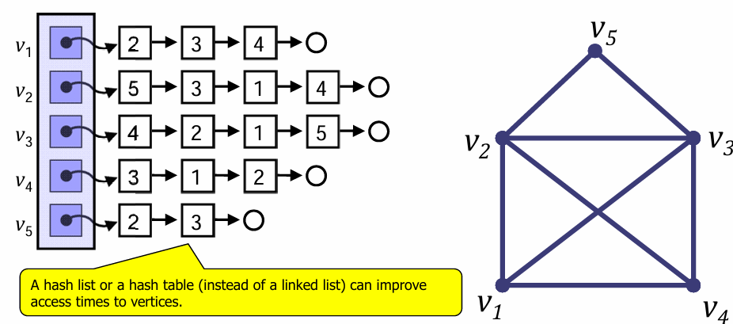
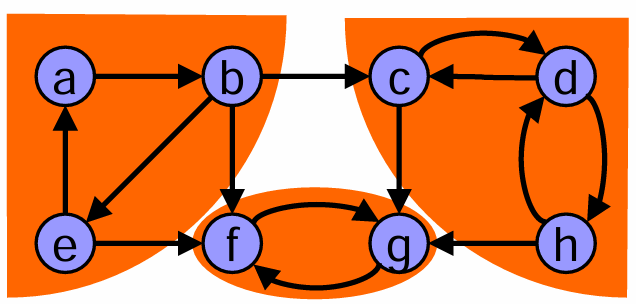

# PAL

<link rel="stylesheet" href="style.css">

## Asymptotická notace

Mějme fci $f(n)$ a funkci $g(n)$. Říkáme, že:

- $f(n) \in \Omega(g(n))$, pokud $(\exist c > 0)(\exist n_0) (\forall n > n_0) : c \cdot g(n) \leq f(n)$
- $f(n) \in \Omicron(g(n))$, pokud $(\exist c > 0)(\exist n_0) (\forall n > n_0) : f(n) \leq c \cdot g(n)$
- $f(n) \in \Theta(g(n))$, pokud $(\exist c_1 > 0, \exist c_2 > 0)(\exist n_0) (\forall n > n_0) : c_1 \cdot g(n) \leq f(n) \leq c_2 \cdot g(n)$

## Grafy

**Node degree** (neboli *stupeň uzlů*) je počet hran, které do nebo z daného vrcholu vedou. Pokud se jedná o orientovaný graf rozlišujeme tzv *indegree* a *outdegree*, kde *indegree* je množina všech vstupních hran a *outdegree* je množinou všech hran výstupních.

Graph **path** (neboli *cesta*), je sekvence hran a vrcholů, kde se žádné 2 vrcholy neopakují, tedy ani hrany.

- **tah** je posloupnost, kde se mohou opakovat vrcholy ale ne hrany
- **sled** je posloupnost, kde se mohou opakovat jak hrany, tak vrcholy

Graph **circuit** je cesta, která je uzvařená, tedy $v_t = v_0$, kde $v_t$ je koncový vrchol cesty a $v_0$ je počátečná vrchol cesty mohou se v ní opakovat vrcholy.

Graph **cycle** je cesta, která je uzavřená stejně jako *circuit*. Oproti němu se ale nesmí opakovat ani hrana ani vrchol.

### Reprezentace grafů

#### Adjacency Matrix

Nechť $G=(V,E)$ je graf s $n$ vrcholy. Značme si je $v_1, ..., v_n$. Adjacency matrix of graph $G$ je čtevrcová matice $A_G=(a_{i,j})^n_{i,j=1}$ definovavné, jako $a_{i,j} == 1 \text{ for }\{v_i,v_j\} \in E \text{ otherwise } 0$.

Jednoduše, pokud jsou hrany spojeny, v daném směru, je tam jednička, pokud spojny nejsou, je tam nula.

#### Laplacian Matrix

Spojení adjecency matrix s informaci o node degree.

Jsou-li hrany spojené, zapiš `-1`, je-li v matici hrana sama se sebou, zapiše její `degree` (tedy počet hran), pokud není s daným vrcholme spojená, zapiš `0`.

#### Incidence Matrix

Matice je tvořena $n\times m$, kde $|V|=n$ a $|E| = m$ a hodnotami $\{-1, 0, 1\}$. Hodnota v poli je rovna:

- $-1$ pokud z  daného vrcholu daná hrana odvádí edge
- $0$ pokud v daném vrcholu hrana neexistuje
- $1$ pokud do daného vrcholu daná hrana vede edge

#### Adjacency List

Jinak se této grafové reprezetnaci také říká *list of neighborurs* neboli listy sousedů. Funguje tak, že pro každý vrchol drží list pointerů na sousední vrcholy.

### Srovnání jednotlivých reprezentací

|               | Adjecency Matrix | Laplacian Matrix | Incidence Matrix      | Adjacency List  |
| ------------- | ---------------- | ---------------- | --------------------- | --------------- |
| Storage       | $\Omicron(V^2)$  | $\Omicron(V^2)$  | $\Omicron(V \cdot E)$ | $\Omicron(V+E)$ |
| Add vertex    | $\Omicron(V^2)$  | $\Omicron(V^2)$  | $\Omicron(V \cdot E)$ | $\Omicron(V)$   |
| Add edge      | $\Omicron(1)$    | $\Omicron(1)$    | $\Omicron(V \cdot E)$ | $\Omicron(1)$   |
| Remove vertex | $\Omicron(V^2)$  | $\Omicron(V^2)$  | $\Omicron(V \cdot E)$ | $\Omicron(E)$   |
| Remove edge   | $\Omicron(1)$    | $\Omicron(1)$    | $\Omicron(V \cdot E)$ | $\Omicron(V)$   |

## Minimum Spanning Tree (Minimální kostra grafu)

**Minimum Spanning Tree** neboli *Minimální kostra grafu* $G=(V,E)$ **je množina vrcholů $V$ a hran $E'$ z grafu $G$, které zajistí, že je každý vrchol grafu $G$ spojen se všemi ostatními vrcholy a to s minimální cenou. Přičemž minimální cena je definovaná jakou součet vah hran grafu, které jsou použity, tedy součet hran z množiny $c(E')$ musí být minimální.

### Algoritmy

#### Jarník-Prim

Algoritmus funguje podobně jako Dijkstra, jen je terminován, jakmile navštíví všechny vrcholy. Funguje tak, že:

1. Začne na jakémkoliv vrcholu. Ten označí jako `visited`  a přidá do prioritního seznamu všechny hrany, které z přidaného vrcholu vedou.
2. Přejde do vrcholu, který není ve stavu `visisted` a opakuje krok č. 1.
3. Končí jakmile jsou přidány všechny vrcholy grafu.

Časová složitost záleží na využitých strukturách. Obecně je ale časová složitost $\Omicron(n\cdot m)$, kde $n=|V(G)|$ a $m=|E(G)|$.

#### Borůvka

**💡 Zajímavost:** Jedná se o nejstarší algoritmus pro MST.

Funguje tak, že postupně spojuje komponenty souvislosti. Na začátku je komponenta sám každý vrchol. V každé fázi vybírá vždy nejlevnější hranu, které směřuje do jiné komponenty souvislosti.

#### Kruskal

Seřadí hrany od nejmenší po nejvyšší. Následně hranu přidá, pokud jejím přidáním nevznikne cyklický graf.

## Strongly Connected Components

Říkáme, že je komponenta silně souvislá, pokud platí, že se mohu dostat z každého vrcholu do jakéhokoliv jiného.

### Kosarju-Shariri

K nalezení takovýchto komponent, se využívá tohoto algoritmu.

## Graph Isomorphism

Otázka zní, jak poznat, že jsou grafy stejné? Řešením je vygenerování certifikátů pro oba dva grafy. Pokud se shodují, pak jsou grafy stejné, pokud ne, tak nejsou isomorfní.